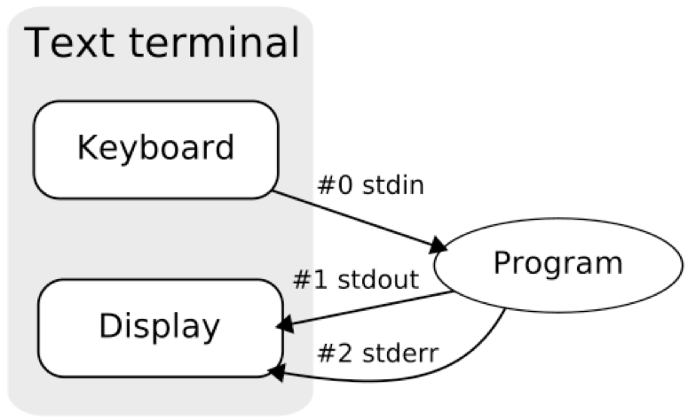

The Book of R: chapter 4.3 (factors), 8 (files)

***

## Module 3 review

* Variable types: list, array, data frame
* List
    * x = listVariable = list(numericVector, stringVector, logicVector, 77)
    * listVariable[1]  #access first list element
    * listVariable[[1]] #access content of first element
* Array
    * arrayVariable = array(c(vector1,vector2),dim = c(3,3,2))
    * arrayVariable[,,1] #get matrix 1
* Data frame
    * patientRecords = data.frame(name, age, smoker)
    * patientRecords[1,] #row 1
    * patientRecords[,1] #column 1
    * patientRecords[1,2] #element at row 1, column 2
    * patientRecords$age
    
***

# Exercise: Querying data frames (10 minutes)

>Using the same variable you read "gene_condition_source_id.txt" into for the previous exercise, find how many unique diseases are linked to TP53?

>Hint: you can access vector elements matching a specific criteria using:
`vectorVariable$colName[vectorVariable$colName=="string"]`

>Hint: ?unique

### Exercise solution (5 minutes)

```{r}
ourdf <- read.table("../data/gene_condition_source_id.txt",
                    sep="\t",header=T,quote="",comment.char="",
                    as.is=T)
ourdf[grep("TP53",ourdf$AssociatedGenes),]
unique(ourdf[ourdf$AssociatedGenes == "TP53","DiseaseName"])

str(grepl("TP53",ourdf$AssociatedGenes))
table(ourdf$AssociatedGenes == "TP53")
```

# Review: data types vs. data structures

* Key programming concept
* Primitive types
    * numeric, logical, string
* Types
    * vector, matrix, array, list, data frame
* Data structure
    * A structure created using types
    * e.g. vector, data frame, tree

| |All same data type | Mixed data types|
|-|-|-|
| 1d | Vector | List |
| 2d | Matrix | Data frame |
| nd | Array | |

# One more variable type: Factors

* Stores categorical variables
* A variable which can be one of a limited number of values
* Create a factor using the factor() function


```{r}
x = c(1,2,3,3,2,1,2,3,1)
x

f = factor(x)
f

#A factor has levels: these are the possible values
levels(f)

```

# Factors and data frames

```{r}
name = c("patient1", "patient2", "patient3")
age = c(46, 49, 50)
smoker = c(T, F, T)

#By default data.frame() creates factors for string variable columns
patientRecords = data.frame(name, age, smoker)
patientRecords
str(patientRecords)   #Note: "Factor w/ 3 levels"

#Tell data.frame() not to create factors
patientRecords2 = data.frame(name, age, smoker, stringsAsFactors=F)
str(patientRecords2)

```

# Exercise: Working with Factors (10 minutes)

>Convert the following protein sequence (just the amino acid sequence part) to a factor and use it to count how many amino acids of each type are in a protein

>Hint: ?summary

>sp|P04637|P53_HUMAN Cellular tumor antigen p53 OS=Homo sapiens
MEEPQSDPSVEPPLSQETFSDLWKLLPENNVLSPLPSQAMDDLMLSPDDIEQWFTEDPGPDEAPRMPEAAPPVAPAPAAPTPAAPAPAPSWPLSSSVPSQKTYQGSYGFRLGFLHSGTAKSVTCTYSPALNKMFCQLAKTCPVQLWVDSTPPPGTRVRAMAIYKQSQHMTEVVRRCPHHERCSDSDGLAPPQHLIRVEGNLRVEYLDDRNTFRHSVVVPYEPPEVGSDCTTIHYNYMCNSSCMGGMNRRPILTIITLEDSSGNLLGRNSFEVRVCACPGRDRRTEEENLRKKGEPHHELPPGSTKRALPNNTSSSPQPKKKPLDGEYFTLQIRGRERFEMFRELNEALELKDAQAGKEPGGSRAHSSHLKSKKGQSTSRHKKLMFKTEGPDSD

### Exercise solution (5 minutes)

```{r}
#add your exercise code here

aaseq <- strsplit("MEEPQSDPSVEPPLSQETFSDLWKLLPENNVLSPLPSQAMDDLMLSPDDIEQWFTEDPGPDEAPRMPEAAPPVAPAPAAPTPAAPAPAPSWPLSSSVPSQKTYQGSYGFRLGFLHSGTAKSVTCTYSPALNKMFCQLAKTCPVQLWVDSTPPPGTRVRAMAIYKQSQHMTEVVRRCPHHERCSDSDGLAPPQHLIRVEGNLRVEYLDDRNTFRHSVVVPYEPPEVGSDCTTIHYNYMCNSSCMGGMNRRPILTIITLEDSSGNLLGRNSFEVRVCACPGRDRRTEEENLRKKGEPHHELPPGSTKRALPNNTSSSPQPKKKPLDGEYFTLQIRGRERFEMFRELNEALELKDAQAGKEPGGSRAHSSHLKSKKGQSTSRHKKLMFKTEGPDSD",
                  split="")[[1]]
table(as.factor(aaseq))
length(levels(as.factor(aaseq)))
table(aaseq)
```


# Files

## Key Programming Concept

# Reminder: Redirect output and input



>$ grep cancer genes2phenotype.txt > myfile.txt

>Will print all lines in “genes2phenotype.txt” that contain “cancer” to the file “myfile.txt” (no output to screen). Use “cat” or “more” to view the contents of myfile.txt

# What is a file

*A file is a set of data stored somewhere and given a name
*Every file is a series of binary numbers, usually thought of as a series of bytes
*A bit is the smallest unit of data a computer can store: either 0 or 1 (a switch is off or on)

| Binary (base 2) | Number (base 10) |
|-----------------|------------------|
| 00              | 0                |
| 01              | 1                |
| 10              | 2                |
| 11              | 3                |

*A byte is 8 bits and can represent up to 2^8 = 256 values
*As a more compact representation, computers often display binary values in hexadecimal (base 16). Two hexademical digits = 16^2 = 256 values = 8 binary digits

| Hexademical (base 16) | Number (base 10) |
|-----------------------|------------------|
| 0                     | 0                |
| 1                     | 1                |
| 2                     | 2                |
| ...                   | ...              |
| a                     | 10               |
| ...                   | ...              |
| f                     | 15               |

*So a file can be thought of as a series of pairs of hexadecimal digits
*UNIX commands are available to view a file as this raw data e.g.

```{bash}
xxd fileOutput.png | head
```

* This is how a PNG image file is stored on disk (the first 80 bytes):
#```{bash}
00000000: 8950 4e47 0d0a 1a0a 0000 000d 4948 4452  .PNG........IHDR
00000010: 0000 0307 0000 01da 0806 0000 0055 6735  .............Ug5
00000020: 9700 0000 0173 5247 4200 aece 1ce9 0000  .....sRGB.......
00000030: 0009 7048 5973 0000 1712 0000 1712 0167  ..pHYs.........g
00000040: 9fd2 5200 0040 0049 4441 5478 01ec dd07  ..R..@.IDATx....
#```

* The data in a file can be represented in different ways
* A common way for text to be represented is in ASCII format


* Numbers 32 to 126 define printable characters e.g. decimal 32 = space
* Note that there are two different ways to say "next line"
    * number 10 (hex: 0A) = line feed
    * number 13 (hex: 0D) = carriage return
* Different operating systems unfortunately use different ways (encodings) to represent "next line".
* macOS and UNIX use line feed (hex: 0A). Windows uses a combination of carriage return and line feed (hex: 0D 0A).
* See more details at https://en.wikipedia.org/wiki/Newline
* Exercise on your own: Use the UNIX xxd command to view a text file and see how the text (and a line break) is represented as ASCII codes.

* Why did we learn this? There are different types of hidden or unexpected characters possible in a file and you sometimes need to be aware of them when reading and writing files. If in doubt, examine your file in a text editor, or use `head` on the command line to view a file and make sure it is the format you are expecting.

* Tip: on UNIX, you can use the file command to see what type of format a file is.

```{bash}
file mydata.txt
file fileOutput.png
```

* A common type of file in data science is a table (like a spreadsheet worksheet, or data frame), usually represented as a tab-delimited format. This type of file should be explored in a spreadsheet application before you try to read it in R

# Working with files in R

```{r}
#Remember to set the working directory
getwd()
#setwd("path")
#setwd("C:/MyDoc")

list.files()
dir()  #this does the same thing
#file.create(), file.rename() and many more

```

# Data import and export

* We usually work with files using read and write functions

```{r}
write.table(patientRecords, "mydata.txt", sep="\t")

mydata = read.table("mydata.txt")
mydata

```

# Exercise: Practice reading and writing files (10 minutes)

>Read the "gene_condition_source_id.txt" file
dataFrame = read.table("gene_condition_source_id.txt", header=TRUE, sep="\t", fill=TRUE, comment.char = "", quote = "")

>count the number of columns and rows

>write one column to a file "column.txt" and write one row to a file "row.txt"

>examine original and resulting files in a spreadsheet - did you get the correct answer?

### Exercise solution (5 minutes)

```{r}
#Add your solution here
ourdf <- read.table("../data/gene_condition_source_id.txt",
                    sep="\t",header=T,quote="",comment.char="")
str(ourdf)
nrow(ourdf)
ncol(ourdf)

write.table(ourdf[,1,drop=F],file="../Week3/a_column.txt",
            sep="\t",col.names=T,row.names=F,quote=F)
shell("head ../Week3/a_column.txt")
shell("wc -l ../Week3/a_column.txt")
write.table(ourdf[,1,drop=F],file="../Week3/a_column_v2.txt",
            sep="\t",col.names=T,row.names=F,quote=F)
shell("head ../Week3/a_column_v2.txt")
shell("wc -l ../Week3/a_column_v2.txt")
write.table(ourdf[,1,drop=F],file="../Week3/a_column_v3.txt",
            sep="\t",col.names=NA,row.names=T,quote=F)
shell("head ../Week3/a_column_v3.txt")
shell("wc -l ../Week3/a_column_v3.txt")


write.table(ourdf[1,],file="../Week3/a_row.txt",
            sep="\t",col.names=T,row.names=F,quote=F)
shell("head ../Week3/a_row.txt")
# shell("awk -F '\t' 'END {print NF}' ../Week3/a_row.txt")
# RStudio's shell doesn't have awk installed, sadly.
# If you're on OSX/Linux, you can try this instead:
# system("awk -F '\t' 'END {print NF}' ../Week3/a_row.txt")
```


# Conditional statements

## Key Programming Concept

# Conditional statements

* if condition is true, then run these commands
* The "if statement"

```{r,eval=FALSE,include=TRUE}
if (test_expression) {
  
  
  statement
}

#Note: indenting is optional, but is good style because indented code is easier to read
```

* Example
```{r}
x = 5
if (x > 0) {
  print("Positive number")
}

x = -5
if (x > 0) {
  print("Positive number")
}
```

# if..else statement

```{r,eval=FALSE,include=TRUE}
if (test_expression) {
  statement1 
} else {
  statement2
}
```

* Example
```{r}
x = 5
if (x > 0) {
  print("Positive number")
} else {
  print("Negative number")
}

```

# if..else if statement

```{r,eval=FALSE,include=TRUE}
if (test_expression1) {
	statement1
} else if (test_expression2) {
	statement2
} else {
	statement3
}
```

* Example
```{r}
x = 5
if (x > 0) {
  print("Positive number")
} else if (x==0) {
  print("Zero")
} else {
  print("Negative number")
}

x = 0
if (x > 0) {
  print("Positive number")
} else if (x==0) {
  print("Zero")
} else {
  print("Negative number")
}

x = -4
if (x > 0) {
  print("Positive number")
} else if (x==0) {
  print("Zero")
} else {
  print("Negative number")
}

```

# Comparison operators
```
<			less than
<=			less than or equal to
>			greater than
>=			greater than or equal to
==			exactly equal to
!=			not equal to
!x			not x
x | y		x OR y
x & y		x AND y e.g. if((x != 3) & (x > 0))
```

Note: identical() function is more generic than == and it can work on any R object

***


