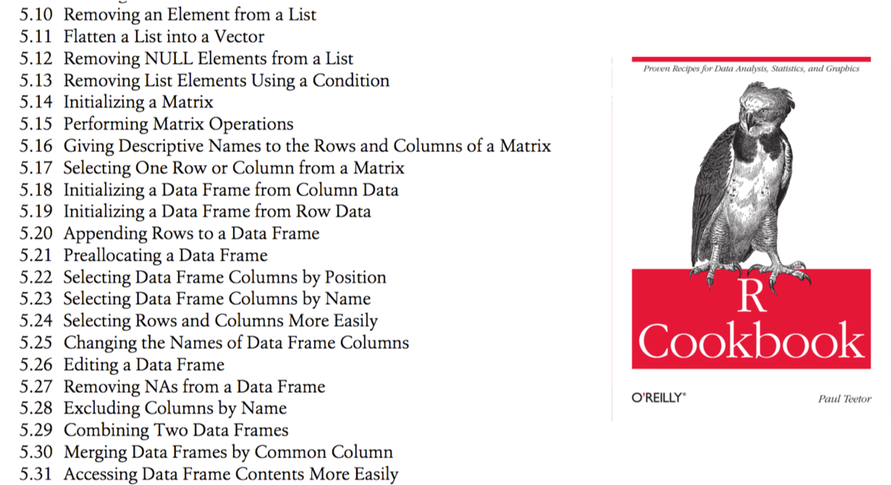

The Book of R: chapter 7.1, 7.2 (plots), ?system2

***

## Module 6 review

* Built in functions

    * ```
mysum = function(arg1) {
  return (sum(arg1))
  }
````

* Regular expressions
    * b[ce]+d
    * b[ce]*d
    
***

# Exercise: A useful function (10 minutes)

>Following on from the previous exercise where you found a string matching a regular expression...

>Write a function that returns all the matches of a regular expression in a string

>Hint: use substring (not substr) – why?

>Test that the function works in the same way as in the previous exercise (by searching DNA for G..A)

### Exercise solution (5 minutes)

# Interfacing with external programs

* You can call/execute an external program from within your script
* Helps you automate certain tasks that would be difficult for you to do within R e.g. useful programs that are not available in R

```{r}
# system2() #calls an external command
system2("ls")  #unix/mac
system2("cmd.exe", input="dir")  #windows

```

# system2 function

```{r}
#returns stdout in variable v
v = system2("ls", stdout=T)
v

#passes arguments to the command (ls)
v = system2("ls", args="-la", stdout=T)
v

```

* What's wrong with system()?
    * It works, but is older and not recommended

# Exercise: external programs (10 minutes)

>Write a script to call a system command

* Mac/unix users
    * Run the “df –h” UNIX command from the shell – what does it do?
    * Call “df -h” from R to see how much space is left on your hard drive
    * Check your results against the “df -h” command you ran
* Windows users
    * Try to run windows "time" or "dir" commands
    * E.g. system2("cmd.exe", input="dir")
    * Can also try shell("dir")

### Exercise solution (5 minutes)

# Recipes
## Code examples and templates

* Recipes are standard way to do things
    * Look up the recipes in a cookbook 



# Example recipes

```{r,eval=FALSE,include=TRUE}
#Sorting a data frame
data_frame = data_frame[order(data_frame$key) , ]
#data_frame$key is the column to sort by
#Note: the sort() function only works for vectors, not data frames

#Sorting by two columns
data_frame = data_frame[order(data_frame$key1,data_frame$key2) , ] 
#The second key is used to break ties in the first

#Removing elements from a list
#Set the value to be NULL
```

# Stack Overflow
* User-contributed question and answer website – good free source of recipes
* e.g. How to delete multiple values from a vector?
    * https://stackoverflow.com/questions/9665984/how-to-delete-multiple-values-from-a-vector
    * https://stackoverflow.com/

# Plots
## Graphically plotting/charting data

# Introduction to plots

```{r}
#R has powerful data plotting abilities
hist(runif(50))
plot(runif(50))
plot(runif(50), runif(50)) #x,y scatter plot
boxplot(runif(50))
demo(graphics)
```

# Exercise: plots (10 minutes)

>Create a matrix “randomdata” with 50 rows and 10 columns using "replicate(10,rnorm(50))"

>Plot the first and second columns of the matrix in a scatter plot

>Generate a vector “randommeans” with the means of all columns of randomdata. Also generate a vector “randomsds” with the standard deviations of all columns of randomdata

>Generate a boxplot of the first and second columns of randomdata

### Exercise solution (5 minutes)

***
